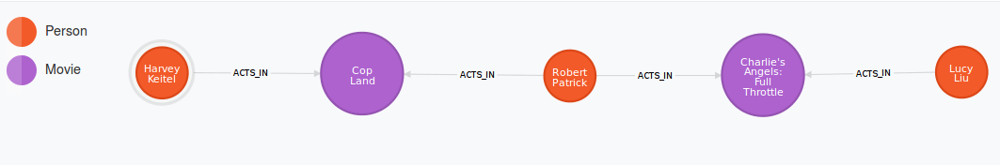
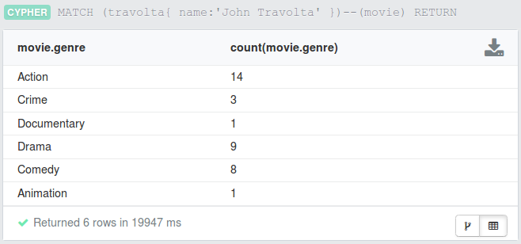
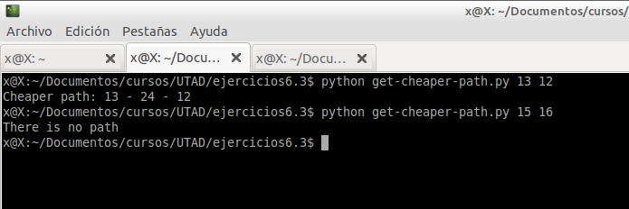

# Ejercicios 6.3
#### By: Javier Serrano

* [Pregunta 1](#pregunta-1)
* [Pregunta 2](#pregunta-2)
* [Pregunta 3](#pregunta-3)
* [Pregunta 4 (bonus)](#pregunta-4-bonus)

## Pregunta 1 ##

>Inicie el servidor con el dataset de ejemplo.

>Escriba las consultas de Cypher necesarias para responder las siguientes preguntas:

**¿Cuántos nodos (de actores y películas) separan, por el camino más corto del grafo, a Harvey Keitel y Lucy Liu (no incluidos)?**

La consulta realizada es:

```
MATCH (lucy{ name:'Lucy Liu' }), (harvey{ name:'Harvey Keitel' }), path=shortestPath(lucy-[*]-harvey)
RETURN path
```
El resultado es:



* **¿Cuáles son los géneros de las películas en las que ha participado John Travolta? ¿En cuántas películas de cada género?**

```
MATCH (travolta{ name:'John Travolta' })--(movie)
RETURN DISTINCT movie.genre
```

El resultado es:


Para contar el número de películas por género, basta con hacer:

```
MATCH (travolta{ name:'John Travolta' })--(movie)
RETURN DISTINCT movie.genre, count(movie.genre)
```

Obteniendo:



[up](#ejercicios-63)<hr/>

## Pregunta 2 ##

>Sobre el mismo dataset, la siguiente consulta de Cypher

>`MATCH ({name:'Henry Fonda'})-[:ACTS_IN]-(m) RETURN m.title`

>devuelve los títulos de las películas en las que ha actuado Henry Fonda.

>A pesar de ser solamente 19 resultados, si no se ha precargado la base de datos en memoria esta consulta tarda varios segundos en ejecutarse.

**¿Qué modificaciones serían necesarias hacer en el esquema y la consulta para obtener los resultados en menos de un segundo?**

>Escriba las consultas en Cypher para lograr esta mejora de rendimiento.

Los cambios a realizar son:

Ejecutar la consulta parametrizada usando el campo `name` en una clausula `WHERE`. La nueva consulta tendrá la siguiente forma:
```
MATCH (n:Person)-[:ACTS_IN]-(m:Movie)
USING INDEX n:Person(name)
WHERE n.name = "Henry Fonda"
RETURN m.title
```
El resultado antes de ejecutar la consulta (obtenido en **3430ms**) es:


Y tras realizar los cambios, obtenemos el resultado en tan solo **210ms**, como se ve en:


[up](#ejercicios-63)<hr/>

## Pregunta 3 ##

>Inicie el servidor con el dataset grahpDb anexo a la actividad.

>El grafo almacenado es una parte de la red ferroviaria de los Estados Unidos. Contiene 133 753 nodos y 174 428 relaciones. Cada nodo puede ser interpretado como una estación y cada relación representa la vía de tren que une directamente dos estaciones.

>Las relaciones tienen una propiedad llamada STFIPS1 que representa el costo de transporte entre las dos estaciones. Esta propiedad es una cadena que contiene un número entero.

>Los nodos tienen una propiedad llamada prop_node_id que identifica las estaciones con un número entero. Además, cada nodo tiene un par de propiedades (prop_latitude, prop_longitude) con las coordenadas de la estación.

>Escriba un programa en Python que reciba como parámetros los identificadores enteros de dos nodos cualesquiera del grafo y devuelva el camino menos costoso entre ambos (aquel donde la suma de los costos de transporte sea menor).

>Si no existiera un camino entre las estaciones, que se muestre un mensaje indicándolo.

>Nota: Consideraremos que las vías se pueden recorrer en ambas direcciones.
Ejemplo de salidas:
$> python get-cheaper-path.py 13 12
Cheaper path: 13 - 24 - 12
$> python get-cheaper-path.py 15 16
There is no path

El cuerpo de la función tendrá el siguiente código:

```{python}
import sys
from neo4jrestclient.client import GraphDatabase

def shortest_path(origin,destiny):
    db = GraphDatabase("http://localhost:7474/db/data/")
    q = lambda origin, destiny: """MATCH (from), (to) , path = (from)-[:DOMAIN_LINK*]->(to)
        WHERE from.prop_node_id='%s' AND to.prop_node_id='%s'
        RETURN path AS shortestPath,
        reduce(distance = 0, r in relationships(path) | distance+r.STFIPS1) AS totalDistance,
        nodes(path)
        ORDER BY totalDistance ASC
        LIMIT 1"""%(origin,destiny)
    path = db.query(q(origin,destiny))[0]
    if path==[]:
        print "There is no path"
        return path
    names = [x['data']['prop_node_id'] for x in path[2]]
    print 'Cheaper path: '+' - '.join(names)
    return path
    
if __name__=="__main__":
    path = shortest_path(*sys.argv[1:])
```

Cuando ejecutamos la siguiente llamda:

```
:~$ python get-cheaper-path.py 13 12
:~$ python get-cheaper-path.py 15 16
```

Obtenemos:



[up](#ejercicios-63)<hr/>

## Pregunta 4 (bonus) ##

>Utilizando el mismo dataset de la pregunta anterior, escriba un programa en Python que calcule las distancias entre cada par de nodos relacionados y las almacene en una nueva propiedad distance dentro de la relación (para simplificar, consideraremos que las vías entre cada par de nodos discurren en línea recta).

>Escriba una versión del programa de la pregunta anterior para obtener el camino con la distancia más corta entre un par de nodos cualesquiera.

>Nota: considere apoyarse en el proyecto Neo4j Spatial.

[up](#ejercicios-63)<hr/>